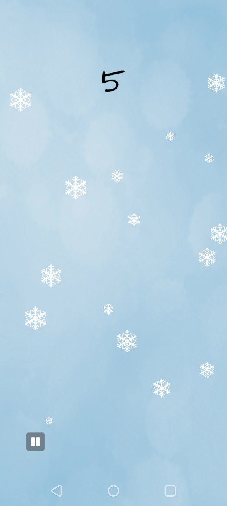
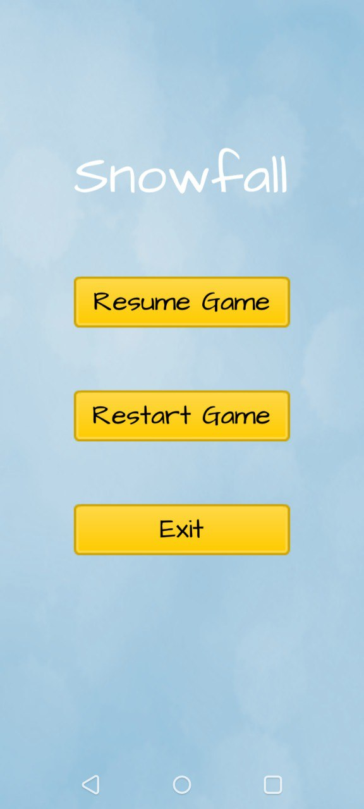

# Snowfall

    

    The Snowfall Game Website

Welcome to Snowfall, a delightful game where you can experience the magic of snowflakes with a simple click. Each delicate snowflake awaits your touch, disappearing in a twinkling flurry as you interact with them on the screen. Explore the serene winter landscape and enjoy the satisfying sensation of making the snowflakes vanish with each tap. Whether you're looking for a calming pastime or a bit of interactive fun, Snowfall invites you to engage with its enchanting world of disappearing snowflakes.

## Screenshots

## Usage

In the project directory, you can run:

### `yarn dev`

Runs the app in the development mode.\
Open [http://localhost:8080](http://localhost:8080) to view it in the browser.

The page will reload if you make edits.\
You will also see any lint errors in the console.

### `yarn build`

Builds the app for production to the `dist` folder.\
It correctly bundles React in production mode and optimizes the build for the best
performance.

The build is minified and the filenames include the hashes.\
Your app is ready to be deployed!
